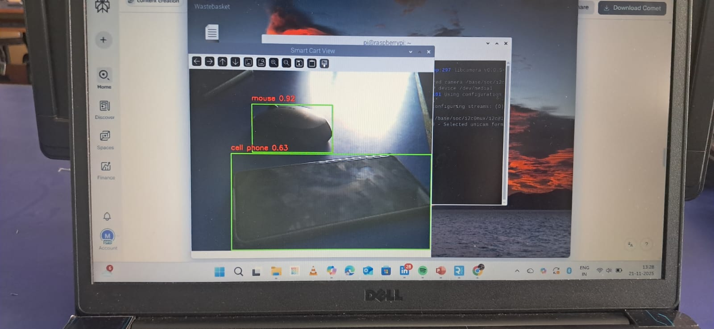
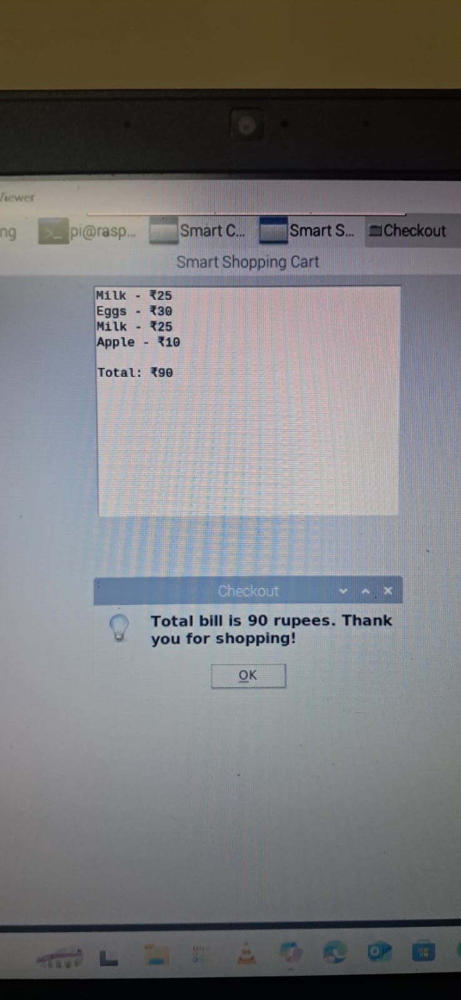
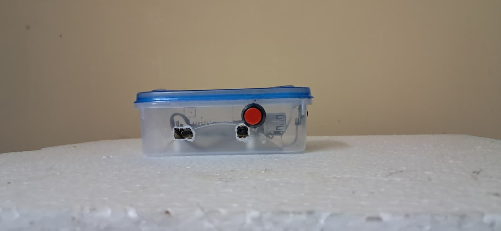
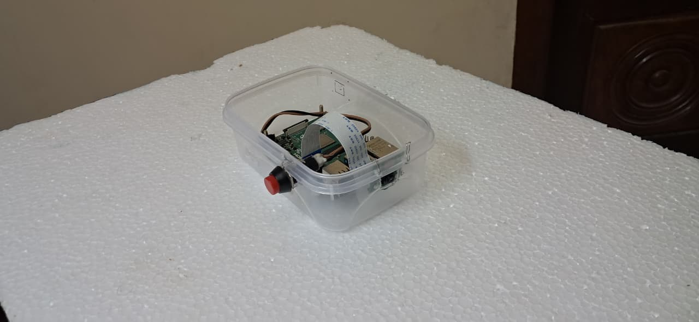
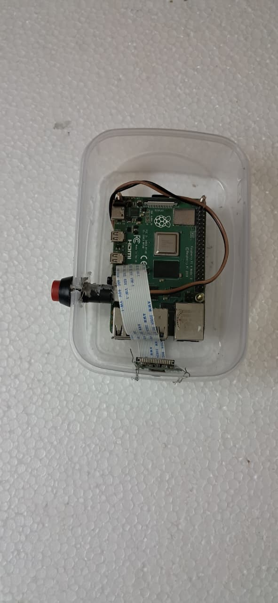
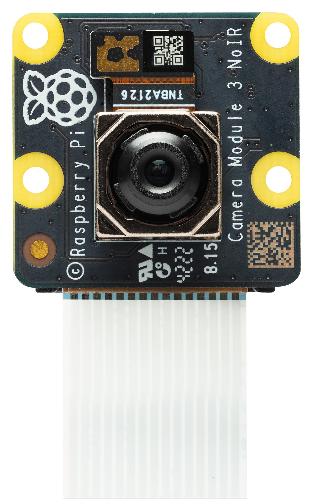

# 🛒 Smart Shopping Assistance for Visually Impaired People

An AI-powered shopping assistance system designed to help visually impaired individuals shop independently using **Computer Vision**, **Object Detection**, **OCR (Optical Character Recognition)**, and **Voice Assistance**.

---

## 📌 Project Overview

Smart Shopping Assistance for Visually Impaired People is an intelligent application that identifies shopping items, reads product labels, detects objects, and provides voice guidance to assist visually impaired users in supermarkets and retail stores.

The system combines Artificial Intelligence and Computer Vision technologies to improve accessibility, enabling users to recognize products and receive spoken information in real time.

---

## ✨ Features

- 🔍 Real-time object detection
- 📷 Product identification using AI
- 📝 Text recognition (OCR)
- 🔊 Voice output for detected information
- 🎤 Voice-guided interaction
- ♿ Accessibility-focused design
- 🛍️ Independent shopping assistance

---

## 🛠️ Technologies Used

- OpenCV
- SpeechRecognition
- pyttsx3 (Text-to-Speech)
- Flask (if web application)
- Linus OS
---

## 📸 Project Gallery

  
  

  
  

  
  

  

---

The application will:

- Detect nearby objects
- Recognize products
- Read product labels
- Provide voice guidance to the user

---

## 🎯 Applications

- Smart supermarkets
- Shopping malls
- Grocery stores
- Retail assistance
- Accessibility solutions

---

## 🔮 Future Enhancements

- Barcode and QR code scanning
- Indoor navigation
- Currency recognition
- Mobile application
- Multi-language voice support
- Cloud database integration

---

## 👨‍💻 Author

VIJAY T
